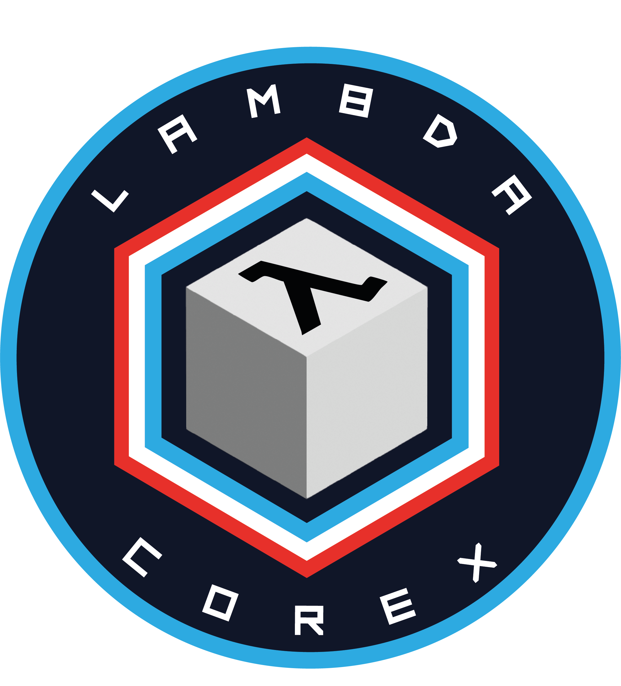

<table>
  <tr>
    <td width="20%" align="center">
      
    </td>
    <td width="80%">
      <h1>🚀 Team Corex</h1>
      
<strong>Team Corex</strong> es un equipo conformado por siete estudiantes de la Universidad Tecnológica Nacional – Facultad Regional Córdoba (UTN FRC), actualmente desarrollando la misión <strong>LAMBDA</strong>, un CubeSat de clase 1U para la competencia <a href="https://utn.edu.ar/es/cubesat-utn">CUBESAT UTN 2025</a>.

    </td>
  </tr>
</table>

 

<table>
  <tr>
    <td width="80%">
      <h2>🛰️ Misión LAMBDA</h2>
      
La misión LAMBDA incluye una colaboración con el Instituto de Investigación Médica Mercedes y Martín Ferreyra (INIMEC - CONICET - UNC), enfocada en estudiar las respuestas fisiológicas del parásito <em>Giardia lamblia</em> ante condiciones extremas durante el lanzamiento.

      
Este experimento contribuirá a entender la resistencia y adaptabilidad de organismos unicelulares en entornos hostiles.

    </td>
    <td width="20%" align="center">
      
    </td>
  </tr>
</table>

---

## 📚 Documentación

Toda la documentación técnica, reportes y especificaciones del proyecto se encuentra disponible en el repositorio [`Docs`](https://github.com/Team-COREX/Docs), o en la siguiente carpeta de [`Drive`](https://drive.google.com/drive/u/1/folders/1Ri3OEng7t4Z0P9lp29xmS_LHC9f3J3kS).

## ⚖️ Licencia

Este proyecto está licenciado bajo los términos de la [Licencia Apache 2.0](https://www.apache.org/licenses/LICENSE-2.0).

## 💡 Apoyanos

¿Querés apoyar el desarrollo de esta misión?

👉 Realizar una donación voluntaria
👉 Comunicate con nosotros si estás interesado en ser Espónsor del proyecto.

